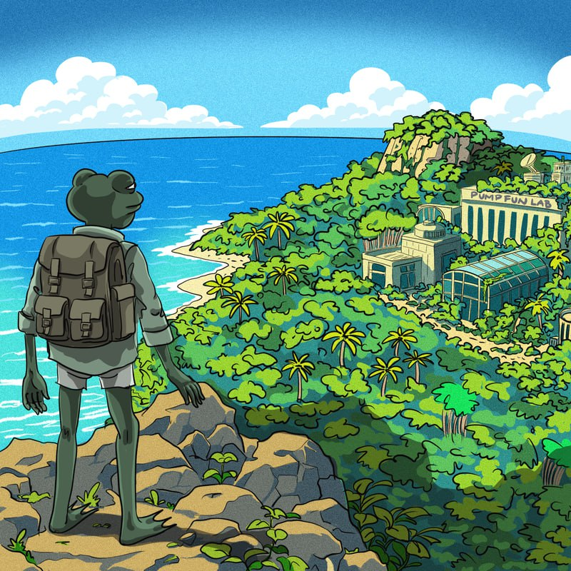
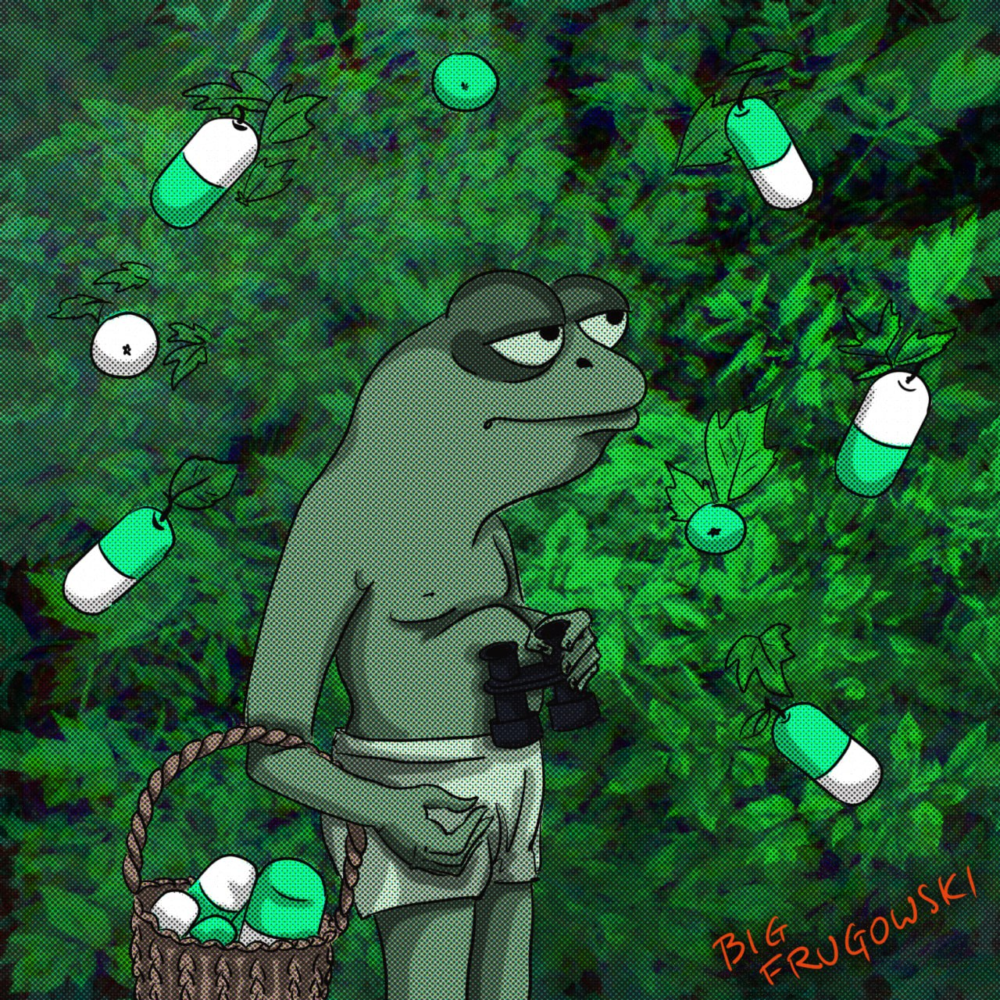
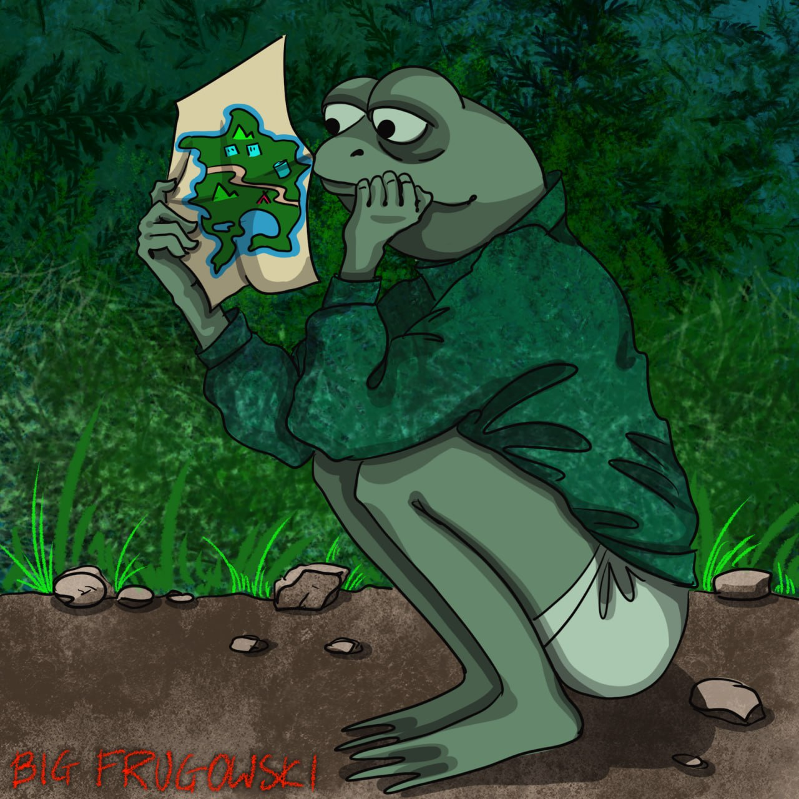
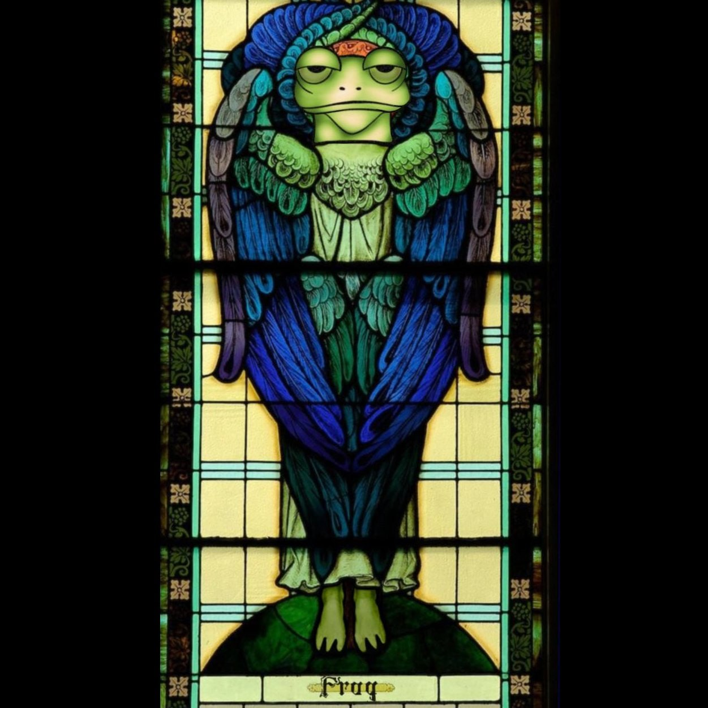

# DEGENORA CODEX

```txt
██████  ███████  ██████  ███████ ███    ██  ██████  ██████   █████  
██   ██ ██      ██       ██      ████   ██ ██    ██ ██   ██ ██   ██ 
██   ██ █████   ██   ███ █████   ██ ██  ██ ██    ██ ██████  ███████ 
██   ██ ██      ██    ██ ██      ██  ██ ██ ██    ██ ██   ██ ██   ██ 
██████  ███████  ██████  ███████ ██   ████  ██████  ██   ██ ██   ██ 

TERMINAL 7-B :: PUBLIC ACCESS
STATUS      :: ONLINE
PROTOCOL    :: SPECIMEN INTEGRATION
```

Welcome to the **Degenora Codex**, a public lore archive for the FRUG IP.

This repo is designed to feel like a game codex.

## Quick links

## Visual archive











- Start here: [Field Report 0001](field-reports/0001-arrival.md)
- [Field Report 0002](field-reports/0002-verdant-expanse.md)
- [Field Report 0003](field-reports/0003-bag-check.md)
- [Field Report 0004](field-reports/0004-base-camp.md)
- World overview: [Degenora Island](codex/degenora-island.md)
- Terminal: [Terminal 7-B](codex/index.md)
- Specimen dossier template: [Template](specimens/_template.md)

## What this is
- A living archive of lore entries and field reports
- A structured format for documenting pump.fun native projects as "specimens"
- A foundation for Terminal 7-B, a terminal style interface concept

## What this is not
- Investment advice
- Price talk
- A promise of future returns

## Official links
- Website: https://frugsolana.xyz
- X (project): https://x.com/FrugSolana
- Telegram (project): https://t.me/frugsolana
- Discord: https://discord.gg/md74jUqgVX

## Repo map
- `field-reports/` chronological logs
- `lore/` longer canon entries
- `specimens/` dossiers for integrated projects
- `codex/` world rules, map notes, terminology
- `terminal/` UI experiments for browsing the archive
- `assets/` images safe to be public

