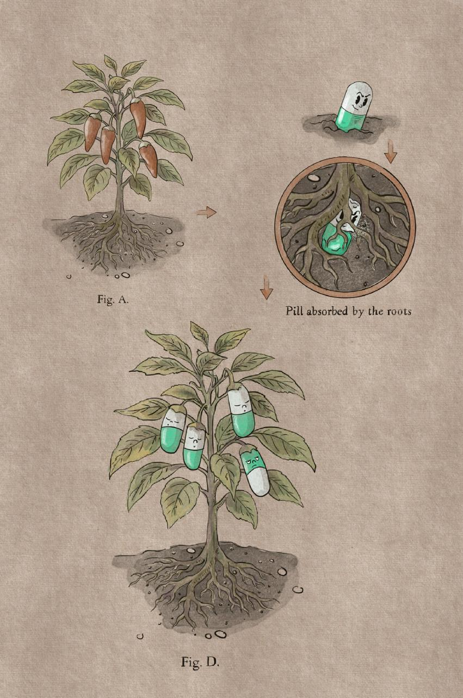

# Field Report 0002: Verdant Expanse

```txt
REGION  :: Verdant Expanse
SUBJECT :: Chili plant
STATUS  :: ACTIVE
```

## Field note
Chili plant stopped producing chilies.

It fruits capsules.

The pill planted itself, got pulled into the roots, then used the plant as a factory.

Wildlife does the distribution.

These pills are not dumb.

## Artifact


## Observer
Field Observer: Big Frugowski, Degenora

