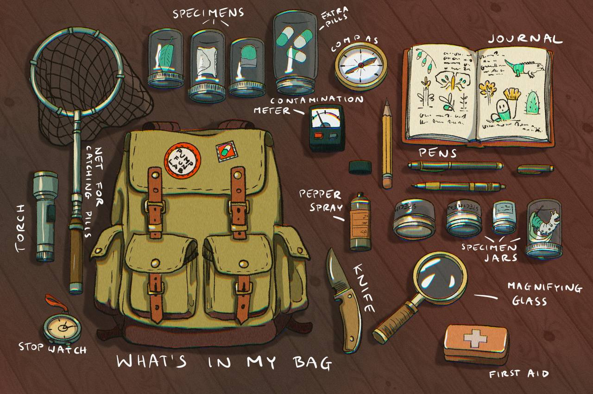

# Field Report 0003: Bag Check

```txt
RITUAL  :: Pre field entry
TOOLING :: Contamination meter
MODE    :: Observe, draw, log
```

## Field note
Before stepping back into the field, the observer checks the bag like a ritual.

Not for comfort.

For proof.

For timing.

For getting back out.

That little meter is the only friend out there.

It tells you when you have stayed too long near the pull.

If a PumpStan is found, do not chase.

Observe.

Draw.

Log.

Everything else is noise.

## Artifact


## Observer
Field Observer: Big Frugowski, Degenora

