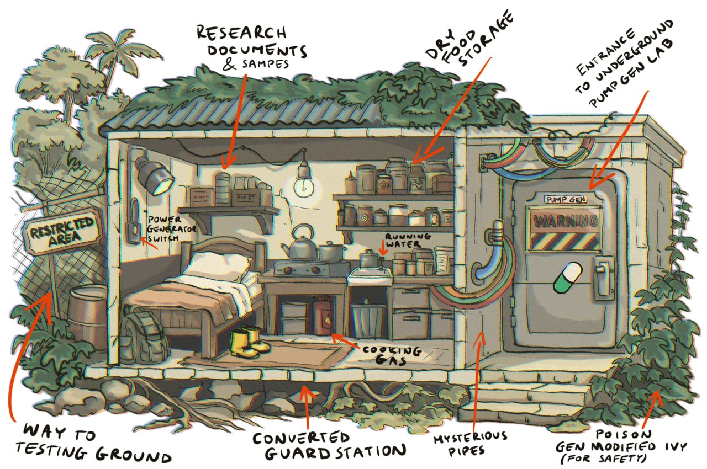

# Field Report 0004: Base Camp

```txt
LOCATION :: Lab tunnel perimeter
STANCE   :: Close enough to observe
RISK     :: Controlled
```

## Field note
This is where the observer stays.

Close enough to the lab tunnel entrance.

Far enough to keep control.

Changes are documented from here.

If the setup shifts, it gets logged.

Outside, people are desperate for the pills.

They interfere using AI, bots, and fake footage.

That is why everything is recorded by hand, as it happens.

## Artifact


## Observer
Field Observer: Big Frugowski, Degenora Island

